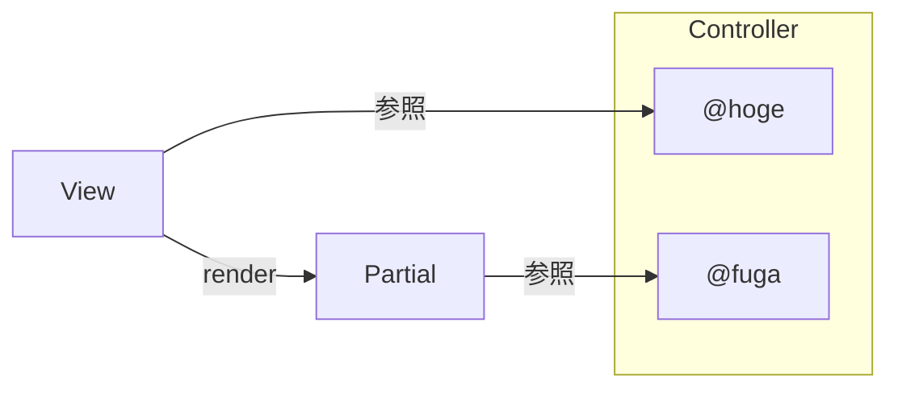
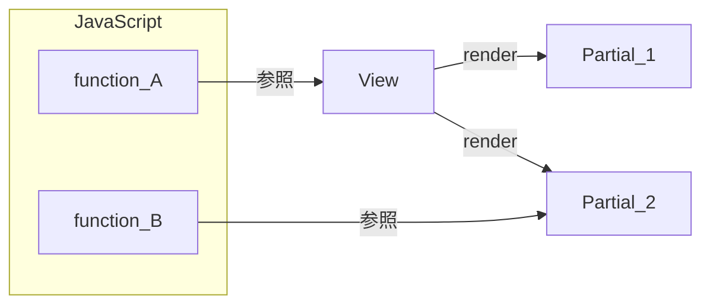
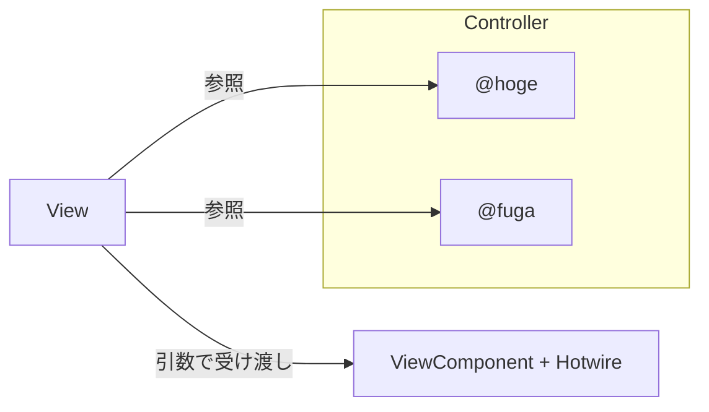
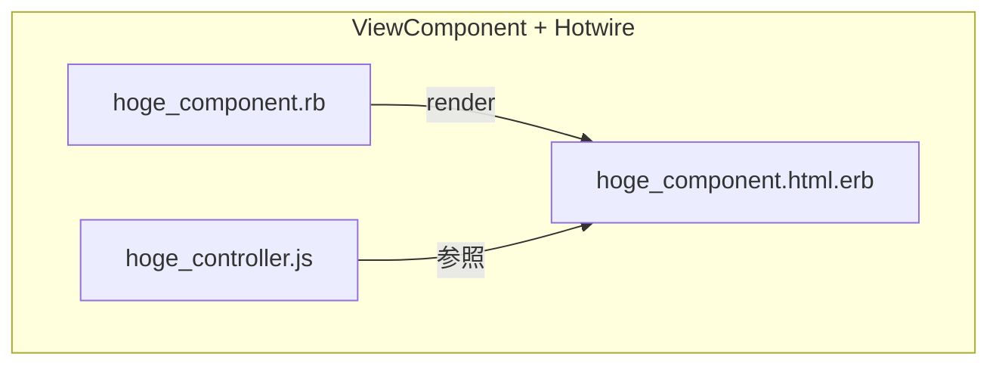
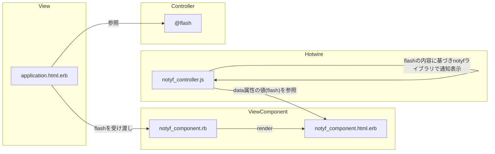

# はじめに

本記事では環境構築について取り扱いません。

詳細につきましては[リポジトリ]('https://github.com/kuroweb/viewcomponent-hotwire-tailwindcss')を参照してください。

# Railsのフロントエンド開発でつらいところ

Railsでフロントエンド開発する場合に、よく使う部品はPartialなどで共通化しますよね？

小規模であればPartialだけで十分なのですが、コードベースが成長したり、複雑なユースケースを満たすようになると以下のような課題が生まれてきます。

### 1. データフローを把握しづらい

PartialはControllerで定義したインスタンス変数を参照できるため、以下のようにデータフローが複雑になりがちです。

Partialに値を受け渡すときにlocalsでの受け渡しを必須にすれば解消できますが、曖昧な方針でPartialを実装しているとカオスになります。



### 2. JavaScriptとViewの依存関係が曖昧で保守しづらい

View単位でJavaScriptファイルを用意するような、大味な実装になってませんか？

これではViewのすべての要素に対してJavaScriptが依存してしまい、ViewやPartialを修正したときに意図しないデグレが発生する可能性があります。つまり、保守性が下がってしまいます。



### 3. テスタブルでない

Partial単体でテストするための優れたテストスイートが存在しないため、View全体にシナリオテストのみ実装するケースが多いように感じます。

そのため、コンポーネント単位でのユニットテストが実装されず、責務が曖昧で再利用性の低いPartialが生まれてしまうのだと考えています。

# ViewComponentとHotwireを組み合わせるとこうなる

### 1. データフローを把握しやすくなる

ViewComponentには引数での受け渡しを強制できるため、データフローが理解しやすくなる（Controllerのインスタンス変数を直接参照できない仕様のため）



### 2. JavaScriptとViewComponentの依存関係が明確で保守しやすい

Hotwire特有のdata属性を用いることで、ViewComponentの単位でJavaScriptファイルを関連付けられるようになります。

値の取得やDOM要素の取得・参照、イベントリスナーの登録などができるようになるため、ViewComponent単位で手続きをカプセル化しやすくなります。つまり、保守性が上がります。



### 3. テスタブルである

ViewComponent単位でHTML要素のユニットテストを実装できるベストプラクティスが存在します。

また、JavaScriptの動作をテストするための方法も用意されており、コンポーネント単位でのユニットテストを少ないコストで実装できるようになります。（ViewComponentのプレビュー機能とcapybaraのsystem specを組み合わせることで、簡単に実装できます。）

# パンくずコンポーネントを実装してみる

よくあるパンくずリストを表示するコンポーネントを実装していきます。

このコンポーネントでHotwireはほぼ使用しませんので、ViewComponent部分に着目してください。

### 1. コンポーネントを実装

以下の3点セットでコンポーネントを実装します。

app/components/layouts/breadcrumb_component.rb

```ruby
module Layouts
  class BreadcrumbComponent < ViewComponent::Base
    def initialize(values)
      @values = values # type: { name: string, url: string | nil }[]
      super
    end
  end
end
```

app/components/layouts/breadcrumb_component.html.erb

```erb
<div data-controller="layouts--breadcrumb">
  <ol class="flex items-center whitespace-nowrap min-w-0" aria-label="Breadcrumb">
    <% @values.each do |value| %>
      <li class="text-sm text-gray-500">
        <div class="flex items-center">
          <% if value[:url].present? %>
            <a href="<%= value[:url] %>" class="hover:text-blue-600"><%= value[:name] %></a>
            <svg class="flex-shrink-0 mx-3 overflow-visible h-2.5 w-2.5 text-gray-400 dark:text-gray-600" width="16" height="16" viewBox="0 0 16 16" fill="none" xmlns="http://www.w3.org/2000/svg">
              <path d="M5 1L10.6869 7.16086C10.8637 7.35239 10.8637 7.64761 10.6869 7.83914L5 14" stroke="currentColor" stroke-width="2" stroke-linecap="round"/>
            </svg>
          <% else %>
            <span class="font-semibold"><%= value[:name] %></span>
          <% end %>
        </div>
      </li>
    <% end %>
  </ol>
</div>
```

app/components/layouts/breadcrumb_controller.js

```js
import { Controller } from '@hotwired/stimulus'

export default class extends Controller {
  connect() {
    // MEMO: コンポーネント固有のJS処理を記述
  }
}
```

パンくずコンポーネントではJavaScriptの処理は必要ないので、stimulusのコントローラーは雛形ファイルだけ用意しておきます。

### 2. Viewからコンポーネントを呼び出す

app/views/layouts/application.html.erb

```erb
<%# <!DOCTYPE html> %>
<html>
  <head>
    <title>App</title>
    <meta name="viewport" content="width=device-width,initial-scale=1">
    <%= csrf_meta_tags %>
    <%= csp_meta_tag %>
    <%= stylesheet_link_tag 'custom' %>
    <%= stylesheet_link_tag "application", "data-turbo-track": "reload" %>
    <%= javascript_include_tag "application", "data-turbo-track": "reload", defer: true %>
  </head>
  <body>
    <div>
      <%= render(::Layouts::Layouts::BreadcrumbComponent.new(
            [
              { name: "Hoge", url: "/hoge" },
              { name: "Fuga", url: "/fuga" },
              { name: "Me", url: "" }
            ]
          )) %>
      <%= yield %>
    </div>
  </body>
</html>
```

`<%= render(::Layouts::HeaderComponent.new(current_user)) %>`がコンポーネントを呼び出す処理になります。(Viewファイルの`Layouts`を参照してしまうため、`::Layouts`とすることでコンポーネントファイルを参照させています。)

コンポーネントに値を渡したい場合は、`.new(current_user)`のように明示的に受け渡すことが強制されます。

これでパンくずコンポーネントを実装できたので、以下のように画面上で確認できます。


### 3. プレビューファイルを実装

ViewComponentのプレビュー機能を利用してみます。

コンポーネント単体で画面表示を確認できるのと、複数のプレビューパターンを定義することもできます。

spec/components/previews/layouts/breadcrumb_component_preview.rb

```ruby
module Layouts
  class BreadcrumbComponentPreview < ViewComponent::Preview
    def with_valid_array
      render(
        Layouts::BreadcrumbComponent.new(
          [
            { name: "Hoge", url: "/hoge" },
            { name: "Fuga", url: "/fuga" },
            { name: "Me", url: nil }
          ]
        )
      )
    end

    def with_blank_array
      render(Layouts::BreadcrumbComponent.new([]))
    end

    def with_nil
      render(Layouts::BreadcrumbComponent.new(nil))
    end
  end
end
```

`http://localhost:3000/rails/view_components`からプレビューの一覧を確認することができます。


それぞれの項目がリンクになっており、クリックすることでプレビューを確認できます。


ちなみに、RSpecのsystem specでは、このプレビュー画面に`capybara`で`visit`することで、HTML要素だけでなくJSのアサーションも可能です。（テストしやすい！）

### 4. RSpecでユニットテストを実装

ViewComponentのヘルパーメソッドと、RSpecのアサーションを利用してユニットテストを実装していきます。

本コンポーネントではHotwireでの実装はないためsystem specは実装しません。

```ruby
require "rails_helper"

RSpec.describe Layouts::BreadcrumbComponent, type: :component do
  describe "#render" do
    context "パラメータが正常な場合" do
      context "パラメータが「任意の正常な値」の場合" do
        it "画面表示に成功すること" do
          render_preview(:with_valid_array)

          expect(page).to be_truthy
        end

        it "パンくずの表示内容が正しいこと" do
          render_preview(:with_valid_array)

          expect(page).to have_link("Hoge", href: "/hoge")
          expect(page).to have_link("Fuga", href: "/fuga")
          expect(page).not_to have_link("Me", href: "/")
        end
      end

      context "パラメータが「空配列」の場合" do
        it "画面表示に成功すること" do
          render_preview(:with_blank_array)

          expect(page).to be_truthy
        end

        it "パンくずが表示されないこと" do
          render_preview(:with_blank_array)

          expect(page).not_to have_selector("a")
          expect(page).not_to have_selector("span.font-semibold")
        end
      end
    end

    context "パラメータが異常な場合" do
      context "パラメータが「nil」の場合" do
        it "例外が発生して表示に失敗すること" do
          expect { render_preview(:with_nil_params) }.to raise_error(StandardError)
        end
      end
    end
  end
end
```

プレビュー機能のおかげてテストするときのコンポーネントの状態がわかりやすく、ユニットテストの実装コストも削減できそうですね。

# ViewComponent + Hotwireで通知コンポーネントを実装してみる

続いて、Hotwireを利用したコンポーネントを実装していきます。

npmの`notyf`ライブラリでトースターを実装します。

まず、データフローがHotwire特有で分かりづらいため整理しておきます。

1. ViewからViewComponentにflashの値を受け渡す
2. ViewComponentのHTML要素のdata属性にflashの値を持たせる
3. Hotwireがdata属性を参照してflashの値を取得
4. Hotwireでnotyfライブラリを使用してトースターを表示



### 1. コンポーネントを実装

app/components/layouts/notyf_component.rb

```ruby
module Layouts
  class NotyfComponent < ViewComponent::Base
    def initialize(flash)
      @flash = flash # type: ApplicationController flashオブジェクト
      super
    end
  end
end
```

app/components/layouts/notyf_component.html.erb

```erb
<div data-controller="layouts--notyf"
     data-layouts--notyf-flash-value="<%= @flash.as_json %>">
</div>
```

app/components/layouts/notyf_component.html.erb

```js
import { Controller } from '@hotwired/stimulus'
import { Notyf } from 'notyf'

export default class extends Controller {
  static values = {
    flash: Array,
  }

  connect() {
    const notyf = new Notyf()
    this.flashValue.forEach((f) => {
      switch (f[0]) {
        case 'notice':
          notyf.success(f[1])
          break
        default:
          notyf.error(f[1])
      }
    })
  }
}
```

### 2. Viewからコンポーネントを呼び出す

app/views/layouts/application.html.erb

```erb
<%# <!DOCTYPE html> %>
<html>
  <head>
    <title>App</title>
    <meta name="viewport" content="width=device-width,initial-scale=1">
    <%= csrf_meta_tags %>
    <%= csp_meta_tag %>
    <%= stylesheet_link_tag 'custom' %>
    <%= stylesheet_link_tag "application", "data-turbo-track": "reload" %>
    <%= javascript_include_tag "application", "data-turbo-track": "reload", defer: true %>
  </head>
  <body>
    <%= render(::Layouts::NotyfComponent.new(flash)) %>
    <div>
      <%= yield %>
    </div>
  </body>
</html>
```

これで通知コンポーネントを実装できたので、以下のように画面上で確認できます。


### 3. プレビューファイルを実装

spec/components/previews/layouts/notyf_component_preview.rb

```ruby
module Layouts
  class NotyfComponentPreview < ViewComponent::Preview
    def with_blank
      render(NotyfComponent.new(ActionDispatch::Flash::FlashHash.new))
    end

    def with_success
      render(NotyfComponent.new(ActionDispatch::Flash::FlashHash.new(notice: "Success")))
    end

    def with_error
      render(NotyfComponent.new(ActionDispatch::Flash::FlashHash.new(error: "Error")))
    end
  end
end
```

これで、各状態ごとのプレビューを確認できるようになりました。


### 4. RSpecでユニットテストを実装

それではRSspecを実装していきます。

JavaScriptのテストをするかどうかで、以下のオプションを使い分けています。

- `js: true, type: :system`: ViewComponentのプレビュー画面と、capybaraのsystem specのアサーションでHTML要素とJavaScriptをテスト
- `type: :component`: ViewComponentのヘルパーと、RSpecのアサーションでHTML要素をテスト

spec/components/layouts/notyf_component_spec.rb

```ruby
require "rails_helper"

RSpec.describe Layouts::NotyfComponent, type: :component do
  describe "#render" do
    context "flashが存在する場合" do
      context "flashが「成功」の場合" do
        it "画面表示に成功すること" do
          render_preview(:with_success)

          expect(page).to be_truthy
        end

        it "成功トースターが表示されること", js: true, type: :system do
          visit("rails/view_components/layouts/notyf_component/with_success")

          assert_selector(".notyf__toast--success", count: 1)
        end
      end

      context "flashが「失敗」の場合" do
        it "画面表示に成功すること" do
          render_preview(:with_success)

          expect(page).to be_truthy
        end

        it "失敗トースターが表示されること", js: true, type: :system do
          visit("rails/view_components/layouts/notyf_component/with_error")

          assert_selector(".notyf__toast--error", count: 1)
        end
      end
    end

    context "flashが空の場合" do
      it "画面表示に成功すること" do
        render_preview(:with_blank)

        expect(page).to be_truthy
      end

      it "トースターが表示されないこと", js: true, type: :system do
        visit("rails/view_components/layouts/notyf_component/with_blank")

        assert_selector(".notyf__toast", count: 0)
      end
    end
  end
end
```

# まとめ

SPAのような複雑で動的な実装にしないのであれば、ViewComponent + Hotwireでも十分だと思いました。

PartialとViewCompoentは共存できるため、試験的に導入してみるのも良いかもしれません。
