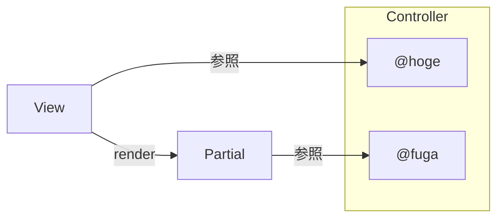
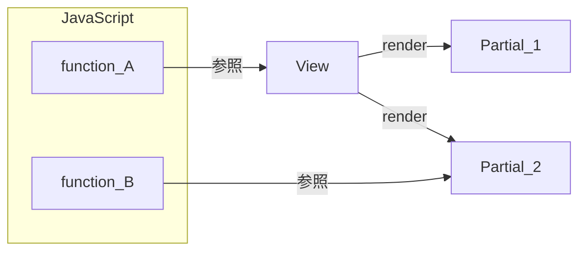
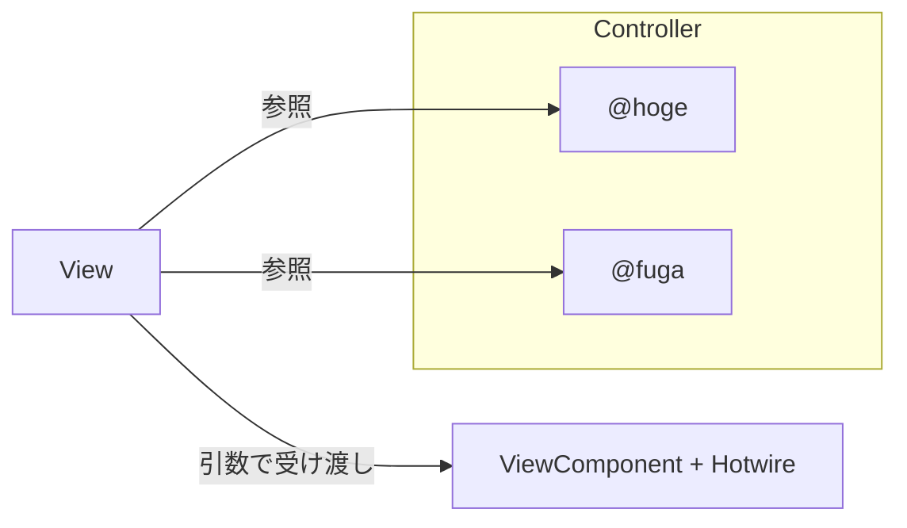
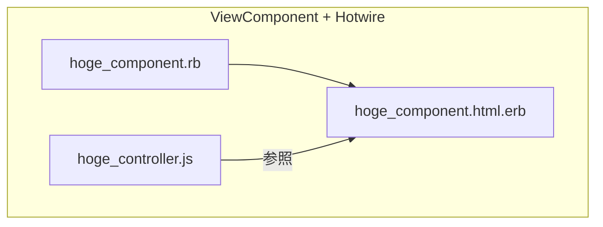
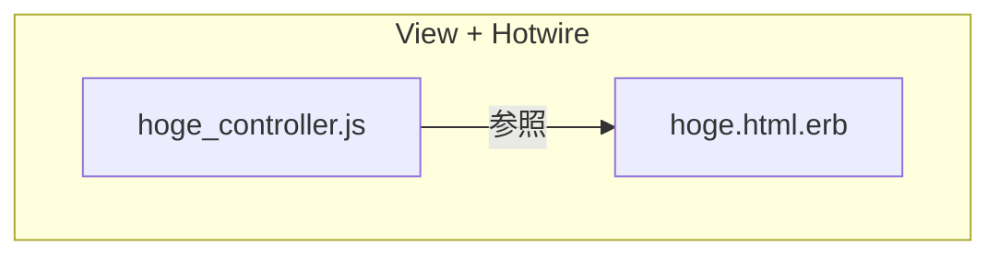

# Railsのフロントエンド開発でつらいところ

Railsでフロントエンド開発する場合に、よく使う部品はpartialなどで共通化しますよね？

小規模であればワークしますが、コードベースが成長したり、複雑なユースケースを満たすようになると以下のような課題が生まれてきます。

1. データフローを把握しづらい
2. JavaScriptとViewの依存関係が曖昧で保守しづらい
3. テスタブルでない

それぞれ詳細を見ていきます

## 1. データフローを把握しづらい

partialはControllerで定義したインスタンス変数を参照できるため、以下のようにデータフローが複雑になりがちです。

Partialに値を受け渡すときにlocalsでの受け渡しを必須にすれば解消できますが、曖昧な方針でPartialを実装しているとカオスになります。



## 2. JavaScriptとViewの依存関係が曖昧で保守しづらい

Template単位でJavaScriptファイルを用意するような、大味な実装になりがち。

Viewのすべての要素に対してJavaScriptが依存する実装になってしまい、TemplateやPartialを修正したときに意図しないデグレが発生するなど、保守性が低下してしまう。



## 3. テスタブルでない

Partial単体でテストするための優れたテストスイートが存在しないため、View全体にシナリオテストのみ実装するケースが多いように感じます。

そのため、コンポーネント単位でのユニットテストが実装されず、責務が曖昧で再利用性の低いPartialが生まれてしまうのだと考えています。

# ViewComponentとHotwireを組み合わせるとこうなる

## 1. データフローを把握しやすくなる

ViewComponentには引数での受け渡しを強制できるため、データフローが理解しやすくなる（Controllerのインスタンス変数を直接参照できない仕様のため）



## 2. JavaScriptとView(ViewComponent)の依存関係が明確で保守しやすい

Hotwire(Stimulus.js)により、ViewComponentのerbファイルとjsファイルを関連付けられる様になる。

また、Hotwire特有のdata属性を用いることで、値の取得やDOM要素の取得、イベントリスナーの登録ができるため、ViewComponent内での実装をカプセル化しやすくなった。



もちろん、HotwireでViewファイルとjsファイルを関連付けることも可能であるため、View全体に対する動的な実装も可能である。



## 3. テスタブルである

ViewComponent専用のヘルパーが用意されており、POROのユニットテストに近い感覚で実装可能である。

また、ViewComponentのプレビュー機能とRSpecを組み合わせることで、コンポーネント単位のプレビューを確認しながらユニットテストを実装できるため、開発者体験が非常に良くて個人的に好きなところです。(Hotwireでコンポーネントに対してJavaScriptを実装した場合は、capybaraでsystem specを書くことも可能です。)

プレビュー機能はStorybookのようにコンポーネント単位で表示できるため、プレビュー機能を活用したユニットテストを整備するほど、コンポーネントの再利用性の向上にも期待できます。

# 実際に実装してみる

## 1. コンポーネントファイルを作成

以下のコマンドで必要なファイルを一括作成します。（※ previewファイルの生成先は、`config/application.rb`の記述により変更しています。）

`rails g component Layouts::Header --stimulus --preview`

```
./
  ├─ app
  │   └─ components
  │       └─ layouts
  │           ├─ header_component.html.erb
  │           ├─ header_component.erb
  │           └─ header_controller.js
  └─ spec
      └─ components
          ├─ layouts
          │   └─ header_component_spec.rb
          └─ previews
              └─ layouts
                  └─ header_component_preview.rb

```

## 2. Stimulusコントローラを登録

以下のコマンドで